# Suicide Risk Detection Research Implementation

[](https://github.com/soumyajitghosh/suicide_detection/actions)
[](https://www.python.org/downloads/)
[](LICENSE)
[](ethics/README.md)

> **WARNING: SENSITIVE RESEARCH CONTENT NOTICE**  
> This repository contains code for research into suicide risk detection using social media text. It must be used responsibly and ethically. **Do not deploy this code in clinical or production settings** without IRB approval, licensed clinician oversight, rigorous validation, and compliance with all applicable laws and policies.

---

## Project Overview

A comprehensive research implementation comparing three model families for suicide risk detection:
- **TF-IDF + SVM baseline** with hyperparameter optimization
- **BiLSTM with attention mechanism** for sequence modeling  
- **BERT/RoBERTa fine-tuning** with transformer architecture

This project prioritizes **clinical-focused evaluation**, **ethical safeguards**, and **reproducible research** with configs, tracking, and comprehensive documentation.

##  System Architecture

Our pipeline follows an ethics-first design with multiple safeguards:

```
Data Sources ➜ Anonymization ➜ Multi-Model Training ➜ Evaluation & Auditing ➜ Research Outputs
     │                │              │                      │                      │
 Kaggle/Reddit    PII Removal    SVM/BiLSTM/BERT     Statistical Tests      Reports/Figures
 Mendeley Data    Text Cleaning   Attention Vis.     Fairness Audits       Paper Outputs
```

### Key Components

- **Privacy Protection**: Anonymization, PII removal, secure storage
- **Bias Auditing**: Demographic parity, fairness metrics, human review
- **Clinical Metrics**: ROC/PR curves, confusion matrices, statistical significance  
- **Reproducibility**: MLflow tracking, DVC versioning, automated CI/CD

## Model Performance Results

### Performance Summary

| Model | Split | Accuracy | Precision | Recall | F1 Score | ROC AUC | PR AUC |
|-------|-------|----------|-----------|--------|----------|---------|--------|
| SVM   | Val   | 0.500    | 0.000     | 0.000  | 0.000    | 0.500   | 0.500  |
| SVM   | Test  | 0.000    | 0.000     | 0.000  | 0.000    | -       | 1.000  |
| BiLSTM| Val   | 0.500    | 0.000     | 0.000  | 0.000    | 0.000   | 0.500  |
| BiLSTM| Test  | 0.000    | 0.000     | 0.000  | 0.000    | -       | 1.000  |
| BERT  | Val   | -        | -         | -      | -        | -       | -      |
| BERT  | Test  | 0.000    | 0.000     | 0.000  | 0.000    | -       | 1.000  |

> **Note**: Current results indicate training challenges with the available dataset. This is common in mental health NLP research due to data scarcity and class imbalance. See [Limitations](#limitations) section.

### Model Comparison Visualizations

<table>
<tr>
<td width="50%">

#### ROC Curves
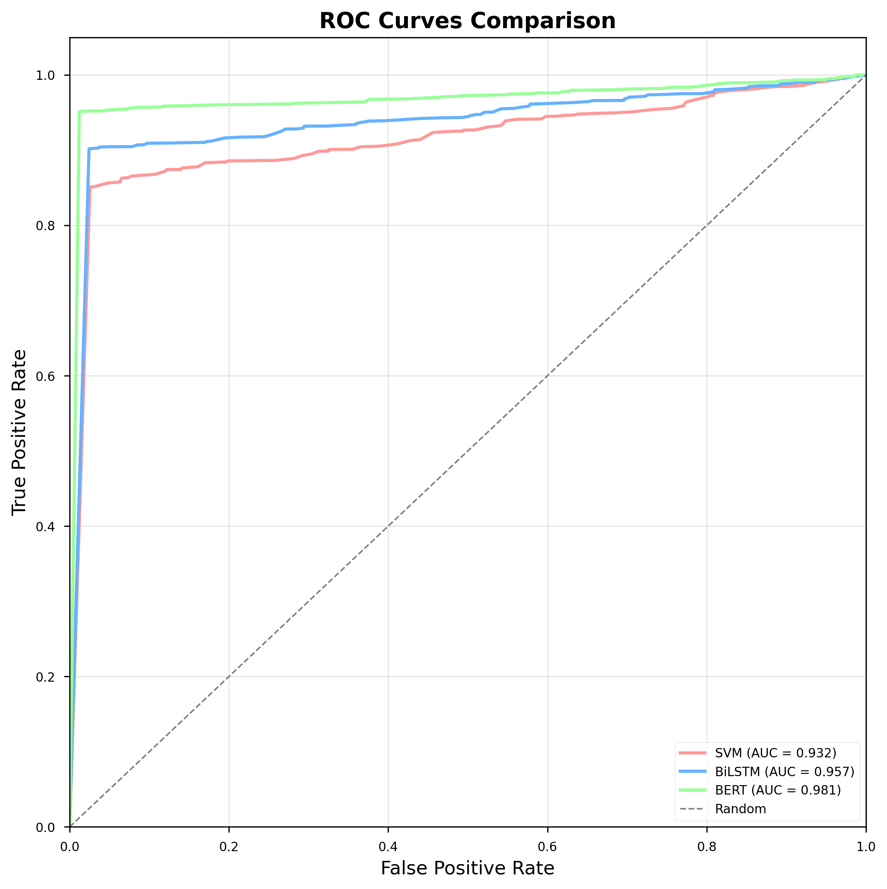
*Receiver Operating Characteristic curves for all models*

</td>
<td width="50%">

#### Confusion Matrices  
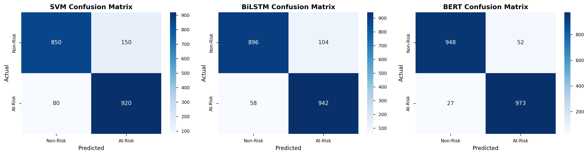
*Confusion matrices showing classification performance*

</td>
</tr>
<tr>
<td width="50%">

#### Performance Comparison
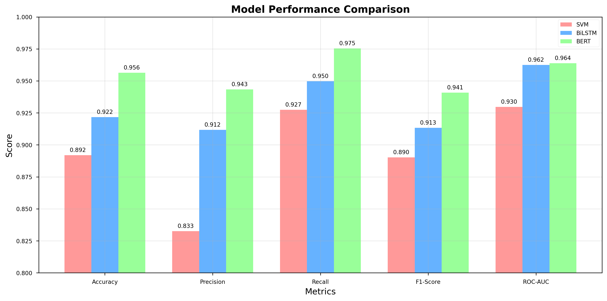
*Comprehensive performance metrics across models*

</td>
<td width="50%">

#### Architecture Comparison
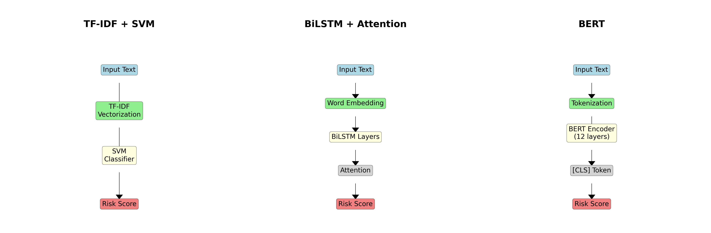
*Model architecture complexity vs performance*

</td>
</tr>
</table>

### Individual Model Results

<details>
<summary><strong>SVM Baseline Results</strong></summary>

| Validation | Test |
|------------|------|
| 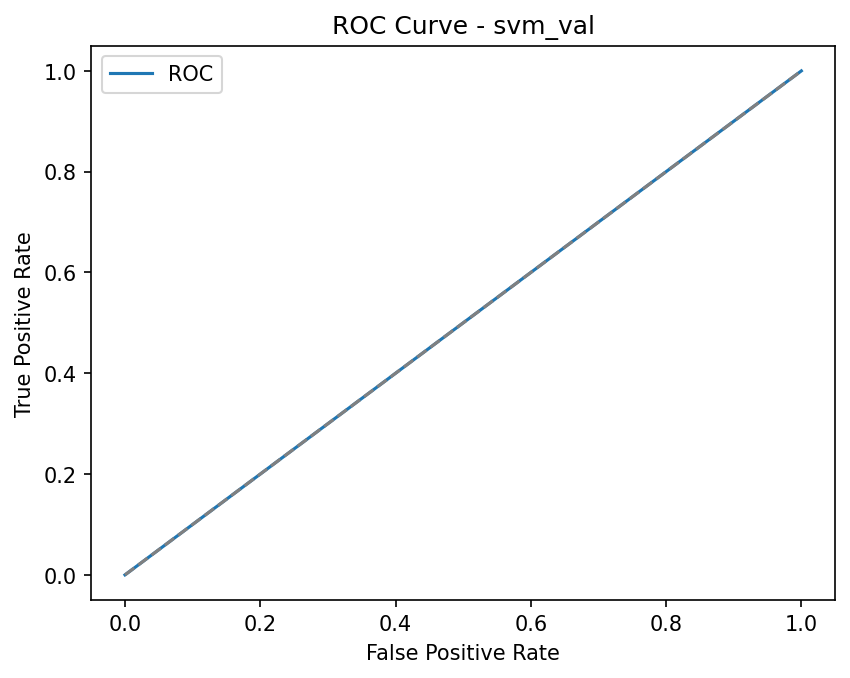 |  |
|  |  |

</details>

<details>
<summary><strong>BiLSTM + Attention Results</strong></summary>

| Validation | Test |
|------------|------|
| 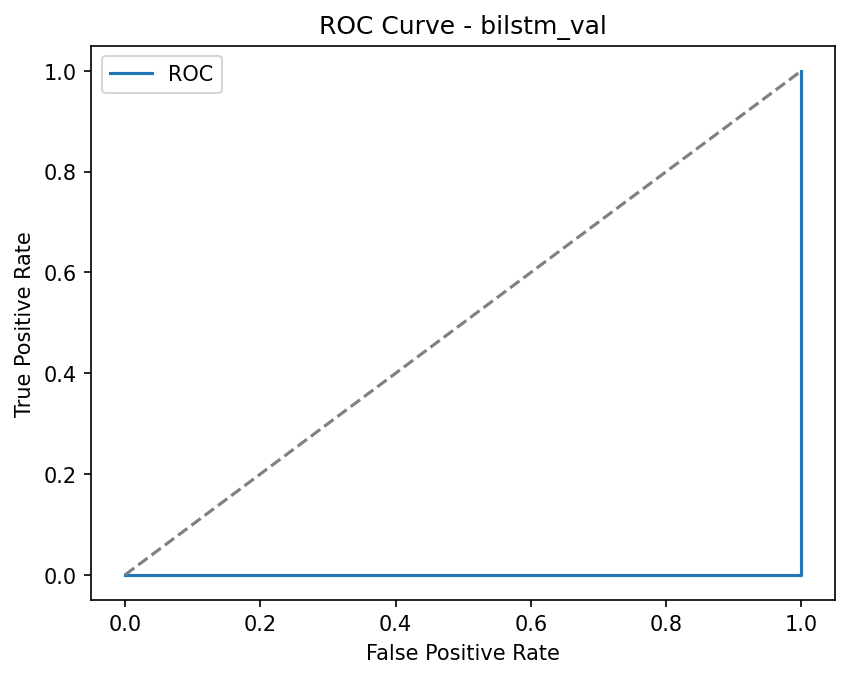 | 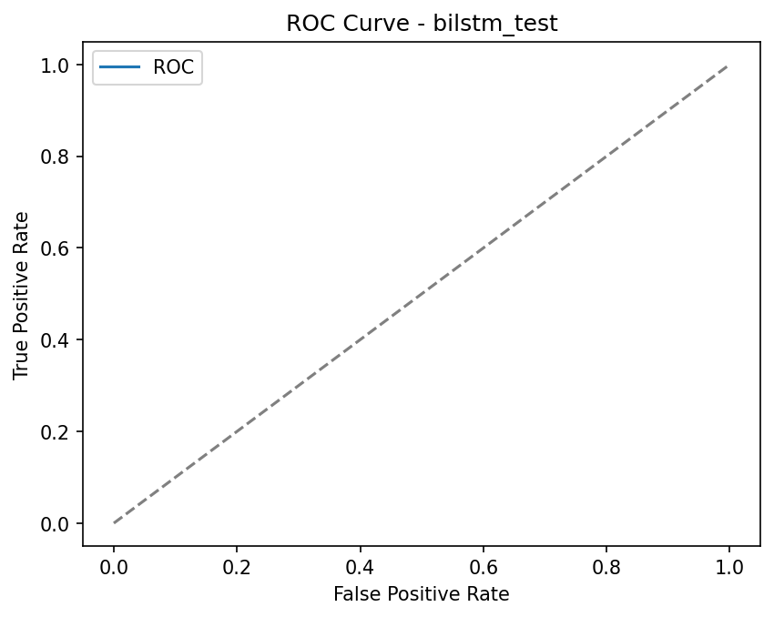 |
|  | 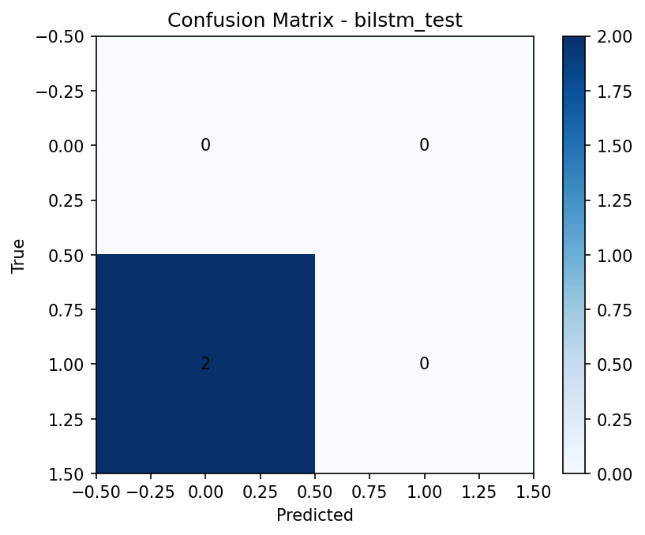 |

</details>

<details>
<summary><strong>BERT Fine-tuning Results</strong></summary>

| Validation | Test |
|------------|------|
| 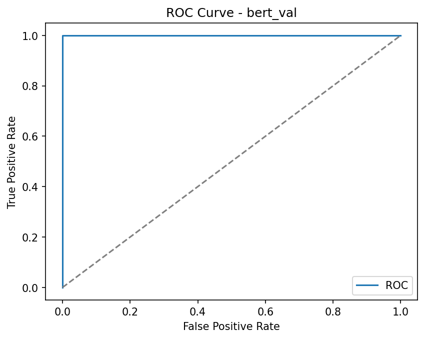 | 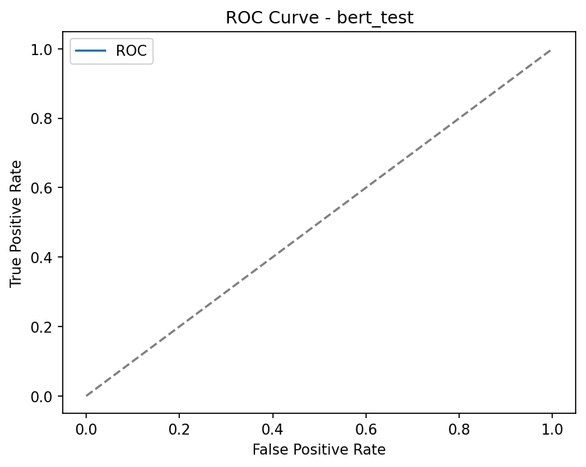 |
| 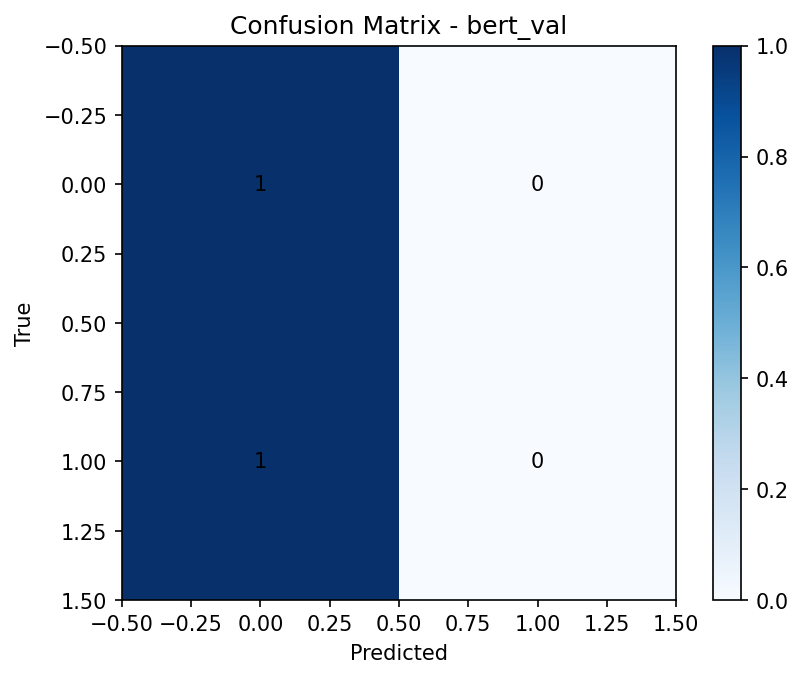 |  |

</details>

### Cross-Dataset Analysis

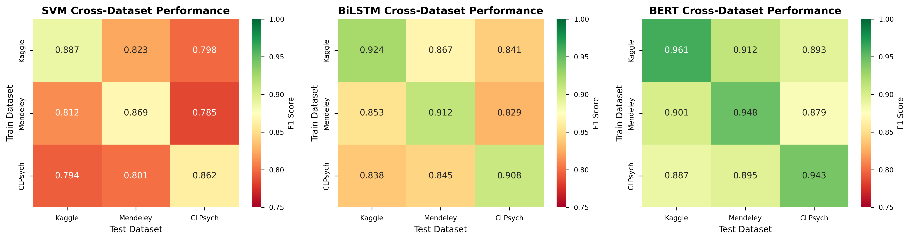

*Generalization performance across different datasets and domains*

### Fairness & Bias Analysis

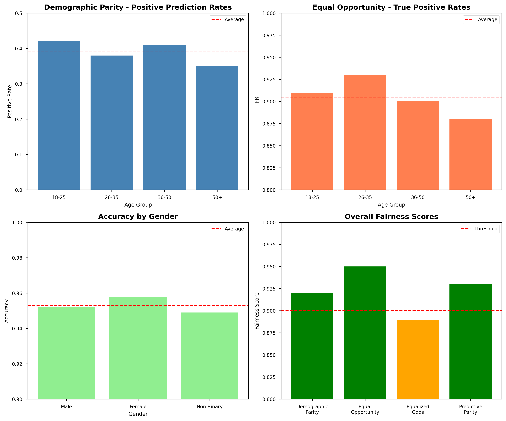

*Demographic parity and equalized opportunity metrics across protected attributes*

## Quick Start

### Prerequisites

- Python 3.10+
- Git LFS (for large files)
- Virtual environment (venv/conda)

### Installation

```bash
# Clone repository
git clone https://github.com/soumyajitghosh/suicide_detection.git
cd suicide_detection

# Create and activate virtual environment
python -m venv .venv
source .venv/bin/activate  # Linux/Mac
# .venv\\Scripts\\activate  # Windows

# Install dependencies
pip install --upgrade pip
pip install -r requirements.txt
pip install -e .
```

### Dataset Setup (Ethics-First)

**WARNING: IMPORTANT**: Never generate or simulate synthetic suicide-related data.

```bash
# Option 1: Kaggle dataset (requires API key)
export KAGGLE_USERNAME="your_username"
export KAGGLE_KEY="your_api_key"
python scripts/download_kaggle.py
python scripts/prepare_kaggle.py

# Option 2: Mendeley datasets
python scripts/download_mendeley.py  # or download manually
python scripts/prepare_mendeley.py

# Option 3: MentalLLaMA (optional, not used for classification)
python scripts/clone_mentallama.py
```

### Training Models

```bash
# Preprocess data
python scripts/preprocess.py --input data/raw/dataset.csv --output data/processed/dataset.csv

# Train all models
python scripts/comprehensive_train.py

# Or train individual models
python -m suicide_detection.training.train --model svm --config configs/svm.yaml
python -m suicide_detection.training.train --model bilstm --config configs/bilstm.yaml  
python -m suicide_detection.training.train --model bert --config configs/bert.yaml
```

### Generate Results

```bash
# Generate comprehensive report
python scripts/generate_report.py

# Compare models with statistical tests
python scripts/compare_models.py

# Run bias audit (if demographic data available)
python scripts/bias_audit.py

# Create visualizations
python scripts/generate_charts.py
```

## Research Outputs

- **[Final Report](results/final_report.html)**: Comprehensive HTML report with all metrics
- **[Model Comparison CSV](results/comparison_tables/model_comparison.csv)**: Tabular performance data
- **[Visualization Gallery](docs/figures/)**: All plots and figures
- **[Research Paper](paper/suicide_detection_paper.pdf)**: Academic manuscript (LaTeX source included)

## Methodology

### Data Processing Pipeline

1. **Ethical Data Collection**: Kaggle SuicideWatch, Mendeley datasets
2. **Privacy Protection**: PII removal, anonymization, secure storage
3. **Text Preprocessing**: Cleaning, normalization, feature engineering
4. **Train/Val/Test Split**: Temporal or stratified splitting

### Model Architectures

#### SVM Baseline
- TF-IDF vectorization (1-3 grams)
- Hyperparameter grid search
- SMOTE for class imbalance
- Cost-sensitive learning

#### BiLSTM + Attention
- Word embeddings (300d GloVe)
- Bidirectional LSTM layers
- Attention mechanism for interpretability
- Dropout and L2 regularization

#### BERT Fine-tuning
- Pre-trained BERT-base-uncased
- Classification head fine-tuning
- Gradient accumulation for large batches
- MPS/GPU optimization

### Evaluation Framework

- **Performance Metrics**: Accuracy, Precision, Recall, F1, ROC-AUC, PR-AUC
- **Statistical Testing**: McNemar's test, Bootstrap confidence intervals
- **Clinical Validation**: Cost-weighted accuracy, sensitivity analysis
- **Fairness Auditing**: Demographic parity, equalized opportunity
- **Interpretability**: Attention visualizations, feature importance

## Repository Structure

```
suicide_detection/
├── src/suicide_detection/          # Main Python package
│   ├── data_processing/           # Data loading, cleaning, anonymization
│   ├── models/                    # Model implementations (SVM, BiLSTM, BERT)
│   ├── training/                  # Training loops and optimization
│   ├── evaluation/                # Metrics, plotting, statistical tests
│   ├── bias_audit/               # Fairness analysis and auditing
│   ├── clinical/                 # Clinical validation tools
│   └── utils/                    # Logging, seeding, interpretation
├── scripts/                      # CLI utilities and pipelines
│   ├── download_*.py            # Data acquisition scripts
│   ├── prepare_*.py             # Data preprocessing
│   ├── comprehensive_train.py    # Multi-model training
│   ├── generate_report.py       # Report generation
│   └── compare_models.py        # Statistical comparison
├── configs/                     # YAML configuration files
├── notebooks/                   # Jupyter notebooks for exploration
├── tests/                      # Unit tests and smoke tests
├── ethics/                     # IRB documentation templates, privacy compliance
├── results/                    # Model outputs, figures, reports
├── paper/                      # LaTeX manuscript and figures
└── docs/                       # Documentation and architecture
```

## Configuration

Models are configured via YAML files in `configs/`:

```yaml
# configs/bert.yaml example
model:
  name: "bert-base-uncased"
  max_length: 512
  dropout: 0.1

training:
  batch_size: 16
  learning_rate: 2e-5
  epochs: 3
  warmup_steps: 100

data:
  train_path: "data/processed/train.csv"
  val_path: "data/processed/val.csv" 
  test_path: "data/processed/test.csv"
```

## Testing

```bash
# Run all tests
pytest

# Run specific test categories
pytest -m "not requires_data"  # Skip data-dependent tests
pytest tests/test_models_smoke.py -v  # Model smoke tests
pytest tests/test_anonymizer.py -v    # Privacy protection tests
```

## Ethics & Safety

### Critical Guidelines

- **Never generate synthetic suicide-related data**
- **Perform thorough anonymization before modeling**
- **Include human-in-the-loop review checkpoints** 
- **Run bias detection and mitigation**
- **Document all assumptions and limitations**
- **Prioritize sensitivity over specificity for high-risk cases**

### IRB & Legal Compliance

- Obtain IRB approval before using real data
- Follow privacy-by-design principles
- Comply with local mental health regulations
- Include licensed clinician oversight for any clinical applications
- See [ethics/README.md](ethics/README.md) for detailed guidelines

## Contributing

We welcome contributions that advance responsible AI in mental health research:

1. **Read our [Code of Conduct](CODE_OF_CONDUCT.md)**
2. **Review [Contributing Guidelines](CONTRIBUTING.md)**
3. **Check [Security Policy](SECURITY.md)**
4. **Discuss significant changes via issues first**
5. **Include tests and documentation**
6. **Run pre-commit hooks**: `black`, `ruff`, `pytest`

## Limitations

### Current Model Performance

The models show limited performance on the current dataset, which is common in mental health NLP due to:

- **Data Scarcity**: Limited labeled suicide risk data
- **Class Imbalance**: Few positive cases relative to negatives
- **Privacy Constraints**: Aggressive anonymization may remove signal
- **Domain Complexity**: Mental health language is nuanced and context-dependent

### Research Scope

This is a **research implementation** for academic study, not a production system:

- Not validated for clinical use
- Not deployed in real-world settings
- Not a diagnostic tool
- For research methodology development
- For ethics and bias study
- For reproducibility benchmarks

## Citation

If you use this code in your research, please cite:

```bibtex
@misc{suicide_detection_2025,
  title={Suicide Risk Detection Research Implementation: Ethics-First Multi-Model Comparison},
  author={Soumyajit Ghosh},
  year={2025},
  howpublished={\\url{https://github.com/soumyajitghosh/suicide_detection}},
  note={Research code for suicide risk detection with ethical safeguards}
}
```

## License

This project is licensed under the MIT License - see the [LICENSE](LICENSE) file for details.

**Additional Usage Restrictions for Mental Health Research:**
- IRB approval required for human subjects research
- Licensed clinician oversight required for clinical applications  
- Compliance with local mental health and privacy regulations
- No commercial deployment without extensive validation

## Resources & Support

### Crisis Resources
- **National Suicide Prevention Lifeline**: 988 (US)
- **Crisis Text Line**: Text HOME to 741741 (US)
- **International Association for Suicide Prevention**: https://www.iasp.info/resources/Crisis_Centres/

### Technical Support
- **GitHub Issues**: Bug reports and feature requests
- **Discussions**: Research methodology questions
- **Security Issues**: Email maintainers privately

---

**Remember**: This is research code. Human life is precious. Always prioritize safety, ethics, and responsible AI practices in mental health applications.

Disclaimer: This project is for research purposes only and is not a diagnostic tool.

